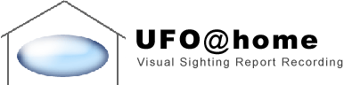

# UFO@home

**UFO@home** lets a UFO witness record the shape, appearance and movement of what they saw — and replay it like a VCR —
instead of relying only on a written or spoken account. The approach follows [Roger Shepard's
recommendation](https://rr0.org/time/1/9/6/8/07/29/Symposium/Shepard/index_fr.html) that a visual reconstruction of a
testimony is more faithful than an oral or written one.

Originally a Java applet (2003), the project has been rewritten from scratch in TypeScript: a small,
dependency-light engine (keyframe timeline, recording, playback, Canvas2D rendering) wrapped in four vanilla
[Web Components](https://developer.mozilla.org/en-US/docs/Web/API/Web_components) — no UI framework, no build step
required by the consuming page. Two of the four (`<rr0-scene>`, and `<rr0-eyewitness>` which always composes it) pull
in [Three.js](https://threejs.org/) for the 3D backdrop — see [`<rr0-scene>`](#rr0-scene--3d-decor) below for why
that's an isolated, opt-in bundle rather than a project-wide dependency.

### Naming

`<rr0-ufo>` is the UFO's own 2D shape/appearance/movement layer — no "player" suffix, since read-only playback is
its default behavior and `<rr0-ufo-recorder>` is the one that needs a qualifier (it *adds* recording on top).
`<rr0-scene>` is named without "ufo" on purpose: it only renders a generic 3D decor (sky/horizon/stars) from a
real-world time and place, with no UFO-specific logic of its own — today it composes a nested `<rr0-ufo>` for the
common case (see its section below), but the decor itself could back other kinds of reconstructions later. A fully
generic version (accepting arbitrary overlay content instead of always creating its own `<rr0-ufo>`) is a natural
follow-up, not implemented yet. `<rr0-eyewitness>` (renamed from `<rr0-ufo-witnesses>` — see below) is the standard
way to display any real sighting, whether it has one witness or several: a witness account always implies a real
place and time, so it always composes `<rr0-scene>`, never a bare `<rr0-ufo>`.

See the [Wiki](https://github.com/RR0/UfoAtHome/wiki) for the project's history, and a live example embedded in
[rr0.org's UFO@home page](https://rr0.org/science/crypto/ufo/enquete/projet/UfoAtHome.html) and in its
[Chiles-Whitted case reconstruction](https://rr0.org/science/crypto/ufo/enquete/dossier/ChilesWhitted/index.html).

## Install

```bash
npm install @rr0/ufoathome
```

Four self-contained, pre-built ES modules are published — each self-registers its custom element as soon as it's
imported, no explicit setup call needed:

```html
<script type="module" src="/node_modules/@rr0/ufoathome/dist-embed-ufo/rr0-ufo.mjs"></script>
<script type="module" src="/node_modules/@rr0/ufoathome/dist-embed/rr0-ufo-recorder.mjs"></script>
<script type="module" src="/node_modules/@rr0/ufoathome/dist-embed-scene/rr0-scene.mjs"></script>
<script type="module" src="/node_modules/@rr0/ufoathome/dist-embed-eyewitness/rr0-eyewitness.mjs"></script>
```

or, from a bundler:

```ts
import "@rr0/ufoathome/ufo"        // registers <rr0-ufo>
import "@rr0/ufoathome/recorder"   // registers <rr0-ufo-recorder> (and <rr0-scene>, which it composes)
import "@rr0/ufoathome/scene"      // registers <rr0-scene> (and <rr0-ufo>, which it composes)
import "@rr0/ufoathome/eyewitness" // registers <rr0-eyewitness> (and <rr0-scene>, which it composes)
```

Only load the one(s) a given page actually needs — `rr0-scene.mjs` and `rr0-eyewitness.mjs` in particular pull in
Three.js and are far heavier than the other two (see their sections below), so pages that just need playback of an
already-drawn shape with no astronomy backdrop should stick to `rr0-ufo.mjs`.

## `<rr0-ufo>` — read-only playback

The lightweight component (~9KB): a canvas plus Play/Pause/Loop/seek controls. Use it wherever a page only needs to
*replay* an already-recorded sighting — this is the one to embed in content pages.

```html
<rr0-ufo src="sighting.json"></rr0-ufo>
```

| Member | Kind | Description |
|---|---|---|
| `src` | attribute | URL of a [`SightingRecordingJson`](#data-format) file, fetched automatically on connect and whenever the attribute changes |
| `sightingData` | property (get/set) | The current recording as a plain [`SightingRecordingJson`](#data-format) object |
| `sighting` | property (readonly) | The live `Sighting` model (real-world time/place + the recording's `Timeline`) |
| `canvasElement` | property (readonly) | The underlying `<canvas>` element |
| `renderer` | property (readonly) | The `CanvasRenderer` instance painting onto that canvas |
| `refresh()` | method | Re-reads the timeline's duration into the seek slider and repaints the current frame — call after externally mutating `sighting.timeline` |
| `loadFromSrc(url)` | method (async) | What the `src` attribute triggers internally; can be called directly too |
| `enableClickToPlay` | property (get/set, default `true`) | Whether clicking the canvas toggles Play/Pause (see below). Composing elements that need the canvas's own click for something else set this to `false` — see `<rr0-ufo-recorder>`. |
| `fullscreenTarget` | property (get/set, default: the component's own stage) | The element the fullscreen button requests fullscreen on. Composing elements that need a *different* element fullscreened set this — see `<rr0-scene>`. |

Playback matches the observation's *real reported duration* when it's known: set `time`/`endTime`, or `time`/
`durationSeconds`, in the [data format](#data-format) (`durationSeconds` takes precedence over `endTime` if both are
given). Watching a 5-minute sighting then takes 5 real minutes, not however long the recording itself took to
author (e.g. a quick mouse drag) — drag the seek bar directly to skip ahead. The start/end labels around the seek
bar show real clock times when `time` has an hour (e.g. `02:45` → `02:50`); otherwise they show `0:00` → the
duration actually available (the declared one if known, else the recording's own length). Playback loops by
default — click the loop button (pressed = looping) to play once and stop instead.

Clicking anywhere on the canvas also toggles Play/Pause (not just the button), matching common video-player UX.
While playing, the toolbar and the fullscreen button (top-right, semi-transparent over the content) auto-hide and
only reappear on hover — always shown while paused/stopped. The fullscreen button uses the standard Fullscreen API
(`requestFullscreen`/`exitFullscreen`); exiting with Escape is native browser behavior, nothing custom.

Labels (Play/Pause, Auto-replay, Current position, Duration, Fullscreen) are translated (English/French) based on
the visitor's `navigator.languages`, falling back to English — there's no language-picker UI, this is the only
mechanism.

## `<rr0-ufo-recorder>` — full editor

The authoring component (~540KB gzip — see below for why): everything `<rr0-ufo>` has, plus a shape/appearance
toolbar (oval/saucer/triangle presets, color, transparency, halo) and drag-to-record. It composes a nested
`<rr0-scene>` internally — not a bare `<rr0-ufo>` — so the shape being drawn is always seen against the
sighting's own real sky, computed live from whatever latitude/longitude/heading/orientation/observation-time
fields the toolbar currently holds (see [Architecture](#architecture)). This absorbs `<rr0-scene>`'s own
Three.js/`astronomy-engine` weight on top of the authoring-only code this element already carried (Recorder
engine, SamplingClock, appearance toolbar) — a page that only needs to *play* a sighting (the common case: an
rr0.org case dossier) should still embed the much lighter `<rr0-ufo>` (or `<rr0-scene>` alone) directly, never
this heavier authoring component.

```html
<rr0-ufo-recorder></rr0-ufo-recorder>
```

Usage: click **Record**, move the pointer over the canvas to draw the UFO's path, click **Stop**, then **Play** to
replay it. The nested `<rr0-ufo>`'s `enableClickToPlay` is set to `false` here — a completed recording drag also
fires a native "click" on the canvas, which would otherwise spuriously toggle playback right after recording.

All of the toolbar's own labels (shape presets, Color/Transparency/Halo, Add shape, Record/Stop, Export JSON,
Duration) are translated (English/French) the same way `<rr0-ufo>`'s own labels are — based on
`navigator.languages`, no picker UI.

| Member | Kind | Description |
|---|---|---|
| `sightingData` | property (get/set) | Delegates to the nested `<rr0-ufo>`'s `sightingData` |
| `appearance` | property (get/set, accepts a partial object on set) | `{ presetId: "oval" \| "saucer" \| "triangle", color: string, transparency: number, haloScale: number }` — the UFO's appearance used for the next recording |

## `<rr0-scene>` — 3D decor

The environmental variant (~530KB gzip — [Three.js](https://threejs.org/) plus
[`astronomy-engine`](https://github.com/cosinekitty/astronomy)'s planetary/lunar position tables, which don't
tree-shake since they're one shared data table used internally for every body — this is by far the heaviest
of the four bundles, load it only on pages that want it): everything `<rr0-ufo>` has, composited over a 3D
sky/horizon/starfield backdrop instead of a plain background. Same markup and members as `<rr0-ufo>` (`src`,
`sightingData`, `loadFromSrc`, `enableClickToPlay`) — it's a drop-in upgrade, including click-to-play/pause
anywhere on the scene (the nested `<rr0-ufo>`'s transparent canvas covers the whole stage). The fullscreen button
fullscreens the *whole* scene (3D backdrop included), not just the nested `<rr0-ufo>`'s own overlay — it sets the
nested element's `fullscreenTarget` to its own outer stage for this.

```html
<rr0-scene src="sighting.json"></rr0-scene>
```

**Real astronomy for misidentification spotting.** A recurring cause of UFO reports is a mundane astronomical
object or atmospheric optical effect — Venus (by far the most commonly misreported "UFO"), other planets, the
Moon, lens flare, or halo phenomena like sun dogs/moon dogs. `<rr0-scene>` renders the sky astronomically: real
Sun/Moon/Venus/Mars/Jupiter/Saturn positions and the Moon's phase via
[`astronomy-engine`](https://github.com/cosinekitty/astronomy) (see `src/engine/astronomy/CelestialPositions.ts`),
and a real star catalog (see below) instead of a randomized field, filtered to naked-eye visibility
(magnitude ≤ 7.5) since these are human eyewitness observations, not instrument-assisted ones. The sky's
darkness/color follows the sun's altitude (day/twilight bands/night), and its dawn/dusk glow is anchored on the
sun's real compass direction, not spread uniformly around the horizon — see `src/render3d/skyColors.ts`.

The witness's own pose — geographic position, elevation, and viewing heading/pitch/field of view — can vary over
the sighting's timeline via `observerTrack` in the sighting JSON (a keyframe array alongside `timeline`, same
hold-last/interpolated-lookup shape — see `src/engine/model/ObserverTrack.ts`), driving both the camera's own
orientation and which real-world instant the astronomy is computed for as playback advances. Older recordings
with no `observerTrack` fall back to the legacy static `place[0]` (see `resolveObserverPoseAt` in
`src/engine/model/Sighting.ts`) — usable for sky darkness/color and camera pitch/fov, but with no compass heading
to orient the camera by.

`src/engine/astronomy/SunPosition.ts` (the original vanilla, dependency-free NOAA/Spencer solar position
approximation) stays in the repo, tested, and still backs `skyBrightness()`'s twilight-band classification — but
the live rendering path now uses `astronomy-engine` for the Sun too, for a single source of truth and to get the
Sun's azimuth from the same call used for the sky's directional glow.

`<rr0-ufo-recorder>` has editor fields for the witness's latitude/longitude/heading and the observation's start
date/time (all optional) — filling in lat+lng writes both the legacy `place` and a single t=0 `observerTrack`
keyframe (elevation/pitch/field of view stay at neutral defaults; there's no UI yet for authoring the observer
*moving* over time, only a single static pose per recording).

Not yet done: sun dog/moon dog/halo rendering, a real (non-flat) ground/terrain, precipitation and other optical
effects (lens flare, mirage), and a multi-keyframe `observerTrack` authoring UI (today the recorder can only set
one static pose; an observer that moves/re-orients mid-recording still needs hand-authored or scripted JSON). The
Moon's phase currently only dims/brightens its disc's overall
color rather than rendering a geometrically accurate crescent shape — a natural follow-up.

**Regenerating the star catalog.** `src/assets/stars-mag7.5.bin` (a compact binary asset, four concatenated
`Float32Array` sections: ra/dec/mag/ci — see `src/render3d/StarCatalog.ts` for the exact layout) is generated
from the [HYG Database v4.1](https://github.com/astronexus/HYG-Database) (CC BY-SA), filtered to magnitude ≤ 7.5.
To regenerate it: download `hyg/CURRENT/hygdata_v41.csv` from that repo into `scripts/data/hygdata_v41.csv`
(gitignored — not checked in, ~34MB), then run `npm run build:stars`. The generated `.bin`/`.json` pair *is*
checked in (~400KB) since it's small and doesn't need regenerating on every install.

The UFO shape itself deliberately stays a 2D overlay on top of the 3D decor, never "upgraded" to a 3D object: it's
what the witness reported — possibly a misidentification or optical effect — not something to interpret as a real
3D shape. Only the surrounding environment, independently computable from real astronomy, is rendered in 3D.

## `<rr0-eyewitness>` — standard sighting view

The standard way to display any real sighting, whether it has one witness or several — renamed from
`<rr0-ufo-witnesses>` once it stopped being just a multi-witness selector (see [Naming](#naming)). It composes a
nested `<rr0-scene>` (not a bare `<rr0-ufo>`) the same way `<rr0-ufo-recorder>` does, since a witness recording is
always a real sighting and always needs the real sky/ground backdrop.

```html
<rr0-eyewitness src="sighting.json"></rr0-eyewitness>
```

`src` accepts either a single witness's `sighting.json` directly (the common case — no extra file needed) or, for
a case with several witnesses, a small manifest: a plain JSON array of each witness's own `SightingRecordingJson`
URL (typically relative to the case's own page, same as `<rr0-ufo>`'s own `src`):

```json
["chiles-sighting.json", "whitted-sighting.json"]
```

The two shapes are told apart automatically — a fetched JSON array is a manifest, a plain object is one witness's
own recording. No labels or ids are duplicated in a manifest itself — each witness's display name and the shared
case id grouping them together are read from that witness's *own* file (`witnessName`/`caseId`, see
[Data format](#data-format)), so there's a single source of truth and nothing to drift out of sync. This means
every listed witness's recording is fetched upfront (to read its name), not lazily on selection — fine at the
scale a case's witness list actually has. If a witness has no `witnessName`, its `witnessId` is shown instead, or
the URL itself as a last resort. A mismatched `caseId` across the listed witnesses logs a console warning (doesn't
block) — likely means unrelated recordings got listed together by mistake.

| Member | Kind | Description |
|---|---|---|
| `src` | attribute | URL of a single `sighting.json` or a witness manifest (above), fetched automatically on connect and whenever the attribute changes |
| `witnessUrls` | property (get/set) | The manifest as a plain array of URLs, for programmatic use instead of `src` |
| `loadFromSrc(url)` | method (async) | What the `src` attribute triggers internally; can be called directly too |

A toolbar row sits above the scene: a "Testimony by &lt;witness&gt;" sentence on the left, and a round "?" info
button on the right. The witness portion is plain text for a single witness (a one-option `<select>` would be
pointless); once there's more than one, it becomes the live `<select>` instead — but the sentence itself, and the
info button, stay visible either way. The first witness loads automatically once the list is known; switching the
selector loads that witness's already-fetched recording into the nested `<rr0-scene>` (no re-fetch). Setting
`witnessUrls` again (e.g. a manifest refresh) keeps the current selection if that witness is still present, instead
of resetting back to the first.

Clicking "?" opens a panel, anchored to the button as a floating overlay (it never shifts the canvas below it).
Its main content is the currently-selected witness's observation metadata (date, location, case id — whichever are
actually present in that witness's own `sighting.json`; the witness's own name isn't repeated here, since it's
already in the toolbar's testimony line). Below that, a smaller footer row holds the app's own name/version on the
left, linking to [ufoathome.org](https://ufoathome.org), and a "Credits" link on the right that reveals third-party
credits on click (the live terrain imagery attribution, once a real relief patch has resolved, plus the bundled
thunder sound's own required attribution — see [`CREDITS.md`](CREDITS.md)).

All of this component's own labels (Testimony by, About, Close, Observation/Date/Location/Case, Credits) are
translated (English/French) the same way as `<rr0-ufo>`'s own labels.

## Data format

Both components read/write a plain, JSON-serializable `SightingRecordingJson`:

```ts
interface SightingRecordingJson {
  version: 1
  time?: { year?: number, month?: number, day?: number, hour?: number, minute?: number, second?: number }
  endTime?: { year?: number, month?: number, day?: number, hour?: number, minute?: number, second?: number } // alternative to durationSeconds
  durationSeconds?: number // alternative to endTime; takes precedence if both are set
  place?: { lat: number, lng: number }[]
  witnessId?: string // opaque internal reference — no PII beyond a display name (see witnessName)
  witnessName?: string // for cases where the witness is already publicly named in the published material (e.g. Chiles-Whitted) — omit for anonymous witnesses
  caseId?: string // shared by every witness's own sighting.json for the same case — see <rr0-eyewitness>
  timeline: {
    keyframes: Array<{
      t: number // milliseconds since recording start
      shapes: Array<{
        sourceId: string // e.g. "ufo-1" — lets several shapes (a UFO, a landmark, a trailing flame...) share one timeline
        shape: {
          kind: "oval" | "polygon"
          bounds: { x: number, y: number, width: number, height: number }
          color: string   // CSS color
          angle: number   // radians
          transparency: number // 0 = opaque, 1 = fully transparent
          haloScale: number    // 0 = no glow
          selected: boolean
          points?: { x: number, y: number }[] // "polygon" shapes only
        }
      }>
    }>
  }
}
```

This format is deliberately independent of [`@rr0/data`](https://github.com/RR0/data)'s `RR0Event`/`@rr0/time`'s
`Level2Date`/`@rr0/place`'s `Place` classes, even though its `time`/`place` fields are structurally aligned with
them — importing those classes into browser-bundled code pulls in Node-only file-scanning dependencies that break a
`vite build`. `src/engine/interop/rr0Data.ts` converts between the two for Node-side tooling (e.g. generating a
case's `sighting.json` from its `RR0Event`).

## Architecture

- `src/engine/` — framework-agnostic core: `model/` (`Shape`, `Timeline`, `Sighting`), `record/` (`Recorder`,
  `SamplingClock`), `playback/` (`Player`), `persistence/` (JSON (de)serialization), `astronomy/` (vanilla solar
  position), `interop/` (real `@rr0/data` conversion, Node-only).
- `src/render/CanvasRenderer.ts` — paints shapes onto a `<canvas>` 2D context.
- `src/render3d/` — the Three.js decor renderer (`SceneRenderer`) and its pure, dependency-free color logic
  (`skyColors.ts`), kept separate so the latter is unit-testable without a WebGL context.
- `src/component/` — the four Web Components. `UfoElement` (`<rr0-ufo>`) owns the canvas/playback; `SceneElement`
  (`<rr0-scene>`) composes it directly (via `document.createElement`, not an inline template tag — see the
  comment at that call site) rather than duplicating it, adding the 3D decor on top. `UfoRecorderElement` and
  `EyewitnessElement` (`<rr0-eyewitness>`) both compose a `SceneElement` in turn (not `UfoElement` directly) —
  the recorder reaches through to its public `ufoElement` property for the actual canvas/timeline/appearance work
  (the toolbar edits the exact same `Sighting` instance the nested scene renders from, so an observer/time/
  appearance change needs no separate sync step to reach the sky), while `EyewitnessElement` reaches through to
  its public `sightingData`/`currentTerrainAttribution` for its own toolbar (witness picker) and info panel.
- Playback linearly interpolates shapes between a source's surrounding keyframes for smooth motion
  (`Timeline.getInterpolatedShapeAt`/`Shape.lerpShape`), holding at the ends of its recorded range.
- Recording samples the pointer position at a configurable rate via `requestAnimationFrame`, not on every
  `pointermove` event.

## Development

```bash
npm install
npm run dev                  # local demo (record + play), Vite dev server
npm test                     # vitest
npm run build                 # type-check + build the demo
npm run build:embed            # build dist-embed/rr0-ufo-recorder.mjs
npm run build:embed-ufo         # build dist-embed-ufo/rr0-ufo.mjs
npm run build:embed-scene       # build dist-embed-scene/rr0-scene.mjs
npm run build:embed-eyewitness  # build dist-embed-eyewitness/rr0-eyewitness.mjs
npm run build:all              # all four
```

## License

MIT
